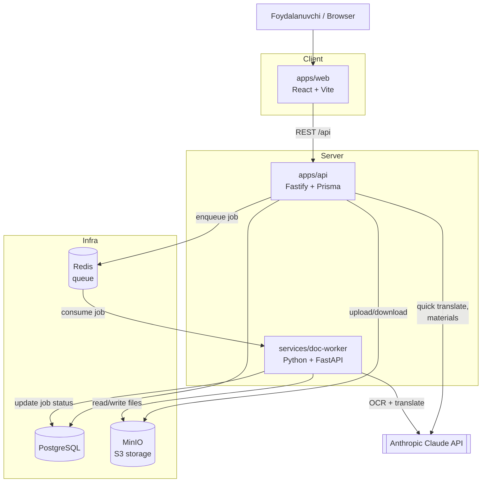
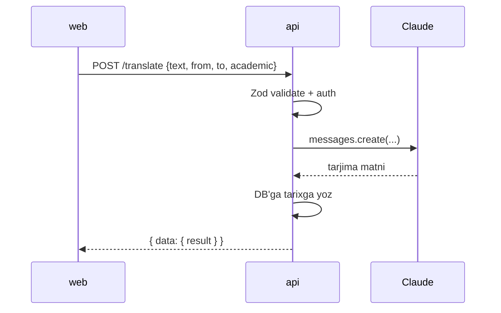
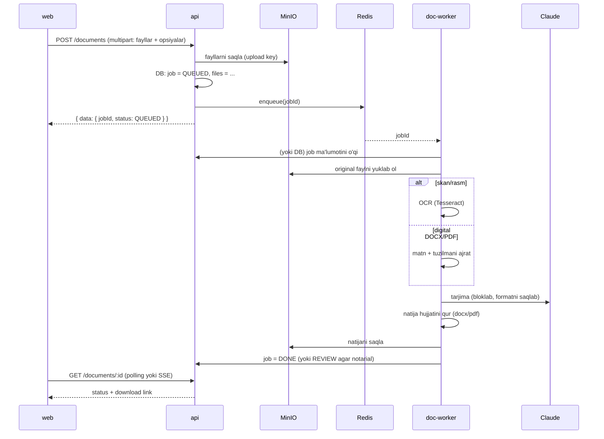

# 02 — Arxitektura

> Tizim qanday ishlaydi: servislar, ma'lumot oqimi, xavfsizlik. Diagrammalar Mermaid'da (GitHub'da render bo'ladi).

## 1. Umumiy ko'rinish



Asosiy g'oya: **frontend faqat o'z backend'imiz bilan gaplashadi.** AI kaliti va og'ir ish (OCR, format saqlash) serverda qoladi.

## 2. Servislar

### apps/web — Frontend
- React 18 + TypeScript + Vite.
- Tailwind (design token'lar `docs/05-DESIGN-SYSTEM.md` dan).
- React Router (sahifalar), TanStack Query (server holati/cache), Zustand yoki Context (mahalliy holat: tema, auth).
- Barcha API chaqiruvlari bitta `apiClient` orqali (Bearer token qo'shadi, xatolarni normallashtiradi).
- Sahifalar prototipga mos: `Dashboard`, `DocumentTranslation`, `QuickTranslate`, `Material`, `History`, `Login`.

### apps/api — Backend
- Node 20 + Fastify + TypeScript.
- Prisma (Postgres ORM), Zod (validatsiya), `jose`/`jsonwebtoken` (JWT), `argon2` (parol hash).
- Vazifalari:
  - Auth (register/login/refresh/me).
  - Tezkor tarjima va material — **sinxron** AI chaqiruvi (`lib/ai.ts`).
  - Hujjat buyurtmasi — faylni MinIO'ga yozadi, DB'ga job yozadi, Redis'ga qo'yadi.
  - Tarix, foydalanuvchi ma'lumotlari, rol tekshiruvi.
- Anthropic bilan ishlaydigan yagona modul: `src/lib/ai.ts` (retry + backoff + output validatsiya).

### services/doc-worker — Hujjat ishchisi
- Python 3.12 + FastAPI (health/status uchun) + worker (Redis'dan job oladi).
- Kutubxonalar: `pytesseract` (OCR), `PyMuPDF (fitz)` (PDF), `python-docx` (DOCX), `pdf2image`, `Pillow`.
- Anthropic SDK (Python) — tarjima uchun.
- Vazifasi: job'ni olib, hujjat turiga qarab qayta ishlaydi (pastda 4-bo'lim), natijani MinIO'ga yozadi, DB'da holatni yangilaydi.

> Nima uchun alohida Python servis? OCR va format saqlash (docx/pdf) Python ekotizimida ancha ishonchli. Sizning Python + Docker tajribangizga ham mos. Muqobil: hamma narsani Node'da (BullMQ worker) qilish — lekin format saqlash qiyinroq.

## 3. Ma'lumot oqimlari

### 3.1 Tezkor tarjima / material (sinxron)



### 3.2 Hujjat tarjimasi (asinxron, queue orqali)



Notarial belgilangan bo'lsa: worker `REVIEW` holatiga qo'yadi, tarjimon tekshirib tasdiqlagach `DONE` bo'ladi (Phase 3).

## 4. Hujjat ishlash strategiyasi (doc-worker)

Format saqlash — real qismning eng qiyini. Hujjat turiga qarab:

| Kirish | Yondashuv | Format saqlash |
|---|---|---|
| **DOCX (digital)** | `python-docx` bilan paragraf/run matnlarini ajrat → Claude bilan bloklab tarjima qil → o'sha stillar bilan qaytar. | ✅ Yaxshi |
| **PDF (digital matn)** | `PyMuPDF` bilan matn bloklarini pozitsiyasi bilan ol; yoki PDF→DOCX→tarjima→PDF. | 🟡 Cheklangan |
| **Skan PDF / JPG / PNG** | `Tesseract` OCR → matn → tarjima → **toza qayta terilgan** DOCX/PDF chiqar. | 🔴 Format emas, toza hujjat |

**Muhim, mijozga ham tushuntiriladi:**
- Digital DOCX uchun format yaxshi saqlanadi (MVP shundan boshlanadi).
- Skan hujjatlar uchun natija — toza, o'qiladigan tarjima; asl vizual layout to'liq takrorlanmaydi.
- **Notarial** variantda AI qoralaydi, **tarjimon tekshirib rasmiylashtiradi** — ustavdagi "professional editing/proofreading"ga mos.

## 5. Xavfsizlik modeli

- **Auth:** access token (qisqa muddat, ~15 min) + refresh token (uzoq, DB'da saqlanadi, bekor qilinadi). Parol `argon2id`.
- **Avtorizatsiya:** har bir resurs egasiga bog'liq. `job.userId === req.user.id` tekshiruvi. Rol middleware (`requireRole('translator')`).
- **Fayllar:** MinIO'da xususiy bucket. Yuklab olish — API orqali **presigned URL** (qisqa muddatli), to'g'ridan-to'g'ri bucket ochiq emas.
- **AI kaliti:** faqat `apps/api` va `doc-worker` env'ida. Frontend hech qachon ko'rmaydi.
- **Validatsiya:** har bir endpoint kirishini Zod bilan tekshiradi. Fayl turi/hajmi cheklovi (masalan ≤ 20MB, ruxsat etilgan MIME).
- **Loglar:** hujjat matni, parol, token loglanmaydi.

## 6. Monorepo va bog'liqlik

```
lingo-bridge/
├── apps/
│   ├── web/        (React)
│   └── api/        (Fastify)  ──imports──► packages/shared
├── services/
│   └── doc-worker/ (Python, mustaqil)
├── packages/
│   └── shared/     (TS tiplar: DTO, enum'lar — web + api ishlatadi)
└── infra/          (docker-compose, Caddy)
```

- `packages/shared` — API request/response tiplari va enum'lar (`Role`, `JobStatus`, ...) bir joyda; web va api import qiladi → tiplar mos.
- `doc-worker` Python bo'lgani uchun tiplarni ulashmaydi; API bilan **DB sxemasi va Redis xabar formati** orqali kelishadi (`docs/04-API.md` dagi job payload).
