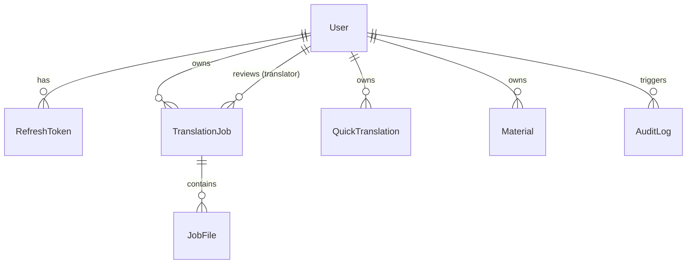

# 03 — Ma'lumotlar bazasi (Database)

> PostgreSQL 16 + Prisma. Barcha o'zgarishlar migratsiya orqali. Ustunlar `snake_case` (Prisma `@map` bilan).

## 1. Sxema diagrammasi



## 2. Enum'lar

```prisma
enum Role {
  CLIENT      // mijoz
  TRANSLATOR  // tarjimon
  ADMIN
}

enum JobStatus {
  QUEUED         // navbatda
  PROCESSING     // tarjima qilinmoqda
  REVIEW         // notarial: tarjimon tekshiruvida
  DONE           // tayyor
  FAILED         // xato
}

enum DocType {
  DIPLOMA
  TRANSCRIPT
  CERTIFICATE
  DISSERTATION
  OTHER
}

enum Lang {
  UZ
  EN
  RU
}

enum CefrLevel {
  A1
  A2
  B1
  B2
  C1
  C2
}

enum MaterialType {
  LESSON_PLAN    // dars rejasi
  EXERCISES      // mashqlar
  PRESENTATION   // taqdimot tezislari
  READING        // o'qish matni
  TEST           // test
  VOCABULARY     // lug'at
}
```

## 3. Prisma modellari

```prisma
generator client {
  provider = "prisma-client-js"
}

datasource db {
  provider = "postgresql"
  url      = env("DATABASE_URL")
}

model User {
  id           String   @id @default(cuid())
  email        String   @unique
  passwordHash String   @map("password_hash")
  fullName     String   @map("full_name")
  role         Role     @default(CLIENT)
  isActive     Boolean  @default(true) @map("is_active")
  createdAt    DateTime @default(now()) @map("created_at")
  updatedAt    DateTime @updatedAt @map("updated_at")

  refreshTokens     RefreshToken[]
  jobs              TranslationJob[]  @relation("JobOwner")
  reviewingJobs     TranslationJob[]  @relation("JobReviewer")
  quickTranslations QuickTranslation[]
  materials         Material[]
  auditLogs         AuditLog[]

  @@map("users")
}

model RefreshToken {
  id        String   @id @default(cuid())
  userId    String   @map("user_id")
  tokenHash String   @unique @map("token_hash")  // faqat hash saqlanadi
  expiresAt DateTime @map("expires_at")
  revoked   Boolean  @default(false)
  createdAt DateTime @default(now()) @map("created_at")

  user User @relation(fields: [userId], references: [id], onDelete: Cascade)

  @@index([userId])
  @@map("refresh_tokens")
}

model TranslationJob {
  id           String    @id @default(cuid())
  userId       String    @map("user_id")
  docType      DocType   @map("doc_type")
  fromLang     Lang      @map("from_lang")
  toLang       Lang      @map("to_lang")
  notarize     Boolean   @default(false)         // notarial tasdiq
  keepFormat   Boolean   @default(true)  @map("keep_format")
  urgent       Boolean   @default(false)
  status       JobStatus @default(QUEUED)
  errorMessage String?   @map("error_message")
  reviewerId   String?   @map("reviewer_id")     // tekshirgan tarjimon
  createdAt    DateTime  @default(now()) @map("created_at")
  updatedAt    DateTime  @updatedAt @map("updated_at")
  completedAt  DateTime? @map("completed_at")

  user     User      @relation("JobOwner", fields: [userId], references: [id], onDelete: Cascade)
  reviewer User?     @relation("JobReviewer", fields: [reviewerId], references: [id])
  files    JobFile[]

  @@index([userId])
  @@index([status])
  @@map("translation_jobs")
}

model JobFile {
  id             String  @id @default(cuid())
  jobId          String  @map("job_id")
  kind           String  // "source" yoki "result"
  originalName   String  @map("original_name")
  storageKey     String  @map("storage_key")     // MinIO obyekt kaliti
  mimeType       String  @map("mime_type")
  sizeBytes      Int     @map("size_bytes")
  createdAt      DateTime @default(now()) @map("created_at")

  job TranslationJob @relation(fields: [jobId], references: [id], onDelete: Cascade)

  @@index([jobId])
  @@map("job_files")
}

model QuickTranslation {
  id         String   @id @default(cuid())
  userId     String   @map("user_id")
  fromLang   Lang?    @map("from_lang")   // null = avto-aniqlash
  toLang     Lang     @map("to_lang")
  sourceText String   @map("source_text") @db.Text
  resultText String   @map("result_text") @db.Text
  academic   Boolean  @default(false)     // akademik atamalar rejimi
  createdAt  DateTime @default(now()) @map("created_at")

  user User @relation(fields: [userId], references: [id], onDelete: Cascade)

  @@index([userId])
  @@map("quick_translations")
}

model Material {
  id           String       @id @default(cuid())
  userId       String       @map("user_id")
  subject      String       // fan
  topic        String       // mavzu
  level        CefrLevel
  type         MaterialType
  outputLang   Lang         @map("output_lang")
  notes        String?      @db.Text
  content      String       @db.Text     // yaratilgan material
  createdAt    DateTime     @default(now()) @map("created_at")

  user User @relation(fields: [userId], references: [id], onDelete: Cascade)

  @@index([userId])
  @@map("materials")
}

model AuditLog {
  id         String   @id @default(cuid())
  userId     String?  @map("user_id")
  action     String   // masalan "job.create", "job.verify", "auth.login"
  entityType String?  @map("entity_type")
  entityId   String?  @map("entity_id")
  metadata   Json?
  createdAt  DateTime @default(now()) @map("created_at")

  user User? @relation(fields: [userId], references: [id], onDelete: SetNull)

  @@index([userId])
  @@index([action])
  @@map("audit_logs")
}
```

## 4. Izohlar / qarorlar

- **`cuid()`** ID sifatida — URL-xavfsiz, ketma-ket emas (raqamli ID'lar buyurtmalarni sanashni oshkor qilardi).
- **Parol va refresh token** — faqat **hash** saqlanadi. Access token DB'da saqlanmaydi (qisqa muddatli, stateless).
- **Fayl kontenti DB'da emas** — MinIO'da; DB'da faqat `storageKey` va metadata.
- **`onDelete: Cascade`** — foydalanuvchi o'chsa, uning ishlari/fayllari ham. Audit log esa `SetNull` (tarix qoladi).
- **Matn maydonlari `@db.Text`** — tarjima/material uzun bo'lishi mumkin.
- **`JobFile.kind`** — bitta job'da ham manba, ham natija fayllari (bir nechta bo'lishi mumkin).
- **Yumshoq o'chirish (soft delete)** kerak bo'lsa keyin `deletedAt` qo'shiladi; MVP'da hard delete + audit.

## 5. Migratsiya va seed

```bash
# Yangi migratsiya (sxema o'zgarganda)
pnpm --filter api prisma migrate dev --name <tavsif>

# Prod'da qo'llash
pnpm --filter api prisma migrate deploy

# Prisma Client generatsiya
pnpm --filter api prisma generate
```

**Seed** (`apps/api/prisma/seed.ts`) quyidagilarni yaratadi:
- Demo mijoz: `demo@lingobridge.uz` / `demo1234`
- Bitta tarjimon va bitta admin (test uchun)
- Bir nechta namuna tezkor tarjima va material (dashboard bo'sh ko'rinmasligi uchun)

## 6. Ma'lumotlarni saqlash siyosati

- Yuklangan **manba fayllar** — buyurtma yakunlangach N kun (masalan 30) saqlanadi, keyin cron bilan tozalanadi (maxfiylik). Metadata qoladi.
- **Natija fayllar** — mijoz yuklab olishi uchun uzoqroq saqlanadi (masalan 90 kun), sozlanadigan.
- Bu qiymatlar env orqali (`FILE_RETENTION_SOURCE_DAYS`, `FILE_RETENTION_RESULT_DAYS`).
